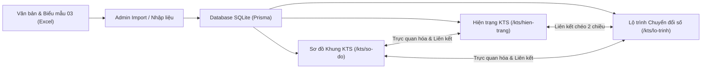

# HƯỚNG DẪN VÀ TÀI LIỆU GIẢI THÍCH LOGIC HỆ THỐNG
## KHUNG KIẾN TRÚC CHÍNH QUYỀN SỐ (KTS) TỈNH VĨNH LONG

---

## I. TỔNG QUAN HỆ THỐNG

Hệ thống **Khung Kiến trúc Chính quyền Số (KTS)** được xây dựng nhằm tin học hóa, số hóa và trực quan hóa toàn bộ Khung Kiến trúc số của tỉnh, bám sát theo:
1. **Quyết định số 1425/QĐ-TTg**: Khung Kiến trúc tổng thể Quốc gia số (Phiên bản 1.0).
2. **Hướng dẫn của Bộ Khoa học và Công nghệ (Bộ KH&CN)** và **Bộ Công an (BCA)** về việc xây dựng khung KTS và rà soát an toàn, liên thông dữ liệu.
3. **Mẫu biểu 03 (Nghị định 278/QĐ)**: Mẫu khảo sát và kiểm kê tài sản số (Hệ thống thông tin, CSDL, Phần mềm, Dịch vụ công) của các Sở, Ban, Ngành địa phương.

### 🛠️ Kiến Trúc Công Nghệ Cốt Lõi
- **Frontend & Backend:** Next.js 15 (App Router, Server Components & Client Components), React 19.
- **UI Components:** Ant Design 5 / 6, Tailwind CSS, Ant Design Icons.
- **Database & ORM:** SQLite (`prisma/dev.db`) thông qua **Prisma ORM**.
- **Xử lý Dữ liệu Excel:** Thư viện `xlsx` (SheetJS) đọc/xuất biểu mẫu Mẫu 03.
- **Xác thực:** NextAuth.js (Session JWT, mã hóa bcrypt).

---

## II. CƠ SỞ DỮ LIỆU & QUAN HỆ LOGIC

Hệ thống được thiết kế theo mô hình quan hệ chặt chẽ giữa **Hiện trạng** và **Lộ trình**:

```
+---------------+         1 - n         +-------------------+
|     DonVi     | --------------------> |    HeThongSo      | (Hiện trạng 389+ hệ thống)
| (Sở, Ngành...) |                       | - ma, ten, lop... |
+---------------+                       +-------------------+
        |                                         |
        | 1 - n                                   | n - n (Liên kết chéo)
        v                                         v
+---------------+         1 - n         +-------------------+
|    NhiemVu    | <-------------------- | HeThongNhiemVu    |
| (Lộ trình NV) |                       | (Quan hệ tác động)|
+---------------+                       +-------------------+
```

- **`DonVi`**: Quản lý các cơ quan/đơn vị chủ quản (Sở NN&PTNT, Sở KH&CN, Sở TTTT, UBND các cấp...).
- **`HeThongSo`**: Đại diện cho các ứng dụng, CSDL, dịch vụ, cổng thông tin hiện có (Hiện trạng).
- **`NhiemVu`**: Các đầu việc, dự án chuyển đổi số cần thực hiện theo các giai đoạn (Lộ trình).
- **`HeThongNhiemVu`**: Bảng liên kết trung gian thể hiện: *Nhiệm vụ này sẽ Nâng cấp / Thay thế / Tích hợp cho Hệ thống số nào trong Hiện trạng*.

---

## III. GIẢI THÍCH CHI TIẾT TỪNG TRANG & LOGIC VẬN HÀNH

### 1. 🏠 Trang Chủ (`/`)
* **Đường dẫn:** `http://localhost:3000/`
* **Mục đích:** Là trang giới thiệu tổng quan, cung cấp kiến thức nền tảng và căn cứ pháp lý về Khung KTS cho toàn thể cán bộ và người dùng.
* **Các khối nội dung:**
  - **Banner Khung KTS:** Căn cứ pháp lý theo QĐ 1425/QĐ-TTg, phiên bản 1.0.
  - **4 Lớp Kiến trúc chuẩn theo QĐ 1425/QĐ-TTg:**
    1. **Lớp 1: Hạ tầng số và an ninh mạng dùng chung** (Cloud, Mạng TSLCD, SOC 4 lớp, IoT).
    2. **Lớp 2: Dữ liệu và nền tảng lõi** (Trục LGSP/NDXP, Kho dữ liệu dùng chung, CSDL Quốc gia, Master Data, Nền tảng định danh VNeID, GIS).
    3. **Lớp 3: Ứng dụng và nghiệp vụ dùng chung** (Chia 2 nhánh: *Chính quyền số* & *Kinh tế số - Xã hội số*).
    4. **Lớp 4: Kênh tương tác và đo lường hiệu quả** (Cổng DVC, Một cửa, Vĩnh Long Smart Mobile App, Dashboard KPIs).
  - **04 Thành phần xuyên suốt:** (1) Quản trị, điều phối & giám sát; (2) Tiêu chuẩn, quy chuẩn kỹ thuật; (3) Chiến lược Ưu tiên AI (AI First); (4) Lấy dữ liệu làm trung tâm (Data-Centric).
  - **Nút điều hướng nhanh:** Chuyển thẳng tới Sơ đồ Khung KTS, Hiện trạng KTS và Lộ trình KTS.

---

### 2. 🏛️ Trang Sơ Đồ Khung Kiến Trúc Tổng Thể (`/kts/so-do`)
* **Đường dẫn:** `http://localhost:3000/kts/so-do`
* **Mục đích:** Thể hiện trực quan toàn bộ **Khung Kiến trúc Tổng thể Quốc gia số (Phiên bản 1.0)** cấp tỉnh theo **Hình 8 - Quyết định 1425/QĐ-TTg**.
* **Cấu trúc thiết kế:**
  - **2 Cột Biên Chạy Dọc (04 Thành phần xuyên suốt):**
    - Cột Trái: *1. Quản trị & Điều phối* • *2. Tiêu chuẩn & Quy chuẩn kỹ thuật*.
    - Cột Phải: *3. Chiến lược Ưu tiên AI (AI First)* • *4. Lấy dữ liệu làm trung tâm (Data-Centric)*.
  - **Trung Tâm (04 Lớp Kiến Trúc Chuẩn Top-Down):**
    - **Lớp 4 (Trên cùng):** Kênh tương tác và đo lường hiệu quả (DVC, Mobile App, Portal, KPI Metric).
    - **Lớp 3:** Ứng dụng và nghiệp vụ dùng chung (Tổ chức 2 cột song song: *Chính quyền số* vs. *Kinh tế số & Xã hội số*).
    - **Lớp 2:** Dữ liệu và nền tảng lõi (Trục LGSP/NDXP, Kho Master Data, CSDL Quốc gia, Nền tảng GIS/SSO).
    - **Lớp 1 (Nền tảng đáy):** Hạ tầng số và an ninh mạng dùng chung (Cloud/IDC, Mạng TSLCD, SOC giám sát 4 lớp, IoT/Camera).
* **Tương tác thông minh:**
  - Nhấp vào bất kỳ khối nào trên sơ đồ để xem định nghĩa, các **CSDL/hệ thống hiện trạng trực thuộc** và các **dự án nâng cấp trong Kế hoạch Lộ trình**.

---

### 3. 📊 Trang Đánh Giá Hiện Trạng (`/kts/hien-trang`)
* **Đường dẫn:** `http://localhost:3000/kts/hien-trang`
* **Mục đích:** Kiểm kê, phân loại và theo dõi trạng thái vận hành của toàn bộ các hệ thống số thuộc quyền quản lý của tỉnh.
* **Logic hoạt động:**
  1. **Khối Thống kê 4 lớp (Stat Cards):** 
     - Tự động đếm tổng số lượng hệ thống theo từng lớp (Lớp 1, Lớp 2, Lớp 3, Lớp 4).
     - Hiển thị thanh tiến độ trực quan mức độ bao phủ.
  2. **Bộ Tab chuyển đổi giữa các Lớp:**
     - Cho phép lọc nhanh danh sách hệ thống theo Lớp 1 (Nghiệp vụ), Lớp 2 (Dữ liệu), Lớp 3 (Ứng dụng), Lớp 4 (Hạ tầng).
  3. **Danh sách Thẻ Hệ Thống (HeThongCard):**
     - Hiển thị Tên hệ thống, Mã định danh (`ma`), Cơ quan chủ quản (`donVi`), Năm triển khai, Trạng thái (Đang vận hành, Đang thử nghiệm, Đề xuất thay thế...).
     - Phân trang tự động (`Pagination`) 10 mục/trang giúp tải mượt mà.
  4. **Popup Chi tiết & Logic Liên Kết Chéo (Cross-Linking Modal):**
     - Khi bấm vào bất kỳ một hệ thống nào, Modal sẽ mở ra hiển thị đầy đủ thông tin mô tả chi tiết trích xuất từ văn bản gốc.
     - **Điểm đột phá logic:** Nếu hệ thống này có liên quan đến một hoặc nhiều nhiệm vụ trong Lộ trình, Popup sẽ hiển thị ngay danh sách:
       - Tên nhiệm vụ lộ trình
       - Phương án xử lý (Nâng cấp / Thay thế / Duy trì)
       - Tiến độ (%) và Hạn hoàn thành.

---

### 4. 🚀 Trang Lộ Trình Chuyển Đổi Số (`/kts/lo-trinh`)
* **Đường dẫn:** `http://localhost:3000/kts/lo-trinh`
* **Mục đích:** Theo dõi tiến độ triển khai các đề án, dự án, kế hoạch nâng cấp hoặc thay thế hệ thống theo thời gian.
* **Logic hoạt động:**
  1. **Bộ lọc Đa chiều (Filters):**
     - Lọc theo Lớp kiến trúc (Tất cả, Lớp 1..4).
     - Lọc theo Trạng thái (Chưa bắt đầu, Đang triển khai, Hoàn thành, Tạm dừng).
  2. **Bảng Quản lý Nhiệm vụ (Table):**
     - **Cột Nhiệm vụ:** Tên nhiệm vụ, mô tả mục tiêu, nhãn phương án xử lý (Màu xanh: Nâng cấp; Màu cam: Thay thế; Màu tím: Xây mới).
     - **Cột Tác động đến Hệ thống (Liên kết ngược):** Hiển thị các nhãn (`Tag`) mã hệ thống hiện trạng chịu tác động. Di chuột vào sẽ hiển thị Tooltip tên đầy đủ của hệ thống.
     - **Cột Đơn vị chủ trì:** Cơ quan chịu trách nhiệm chính.
     - **Cột Hạn chót & Cảnh báo:** Tự động tính toán số ngày còn lại (`getDaysRemaining`), tự động gán icon cảnh báo nếu quá hạn (`isOverdue`).
     - **Cột Tiến độ:** Thanh `Progress` bar thể hiện % hoàn thành thực tế.

---

### 5. ⚙️ Phân Hệ Quản Trị (`/admin`)
* **Đường dẫn:** `http://localhost:3000/admin`
* **Mục đích:** Dành cho quản trị viên và cán bộ các Sở để cập nhật dữ liệu, thêm mới hệ thống, chỉnh sửa nhiệm vụ và nạp file Excel hàng loạt.

* **Các phân hệ con:**
  1. **Quản trị Hệ thống số (`/admin/he-thong`):**
     - Thêm mới, chỉnh sửa thông tin, xóa các hệ thống số trong cơ sở dữ liệu.
  2. **Quản trị Nhiệm vụ (`/admin/nhiem-vu`):**
     - Tạo nhiệm vụ mới, thiết lập thời hạn, gán đơn vị chủ trì và chọn các hệ thống số liên quan.
  3. **Thông tin Khung KTS (`/admin/khung`):**
     - Cập nhật số hiệu quyết định ban hành, đại diện phụ trách, thời gian áp dụng khung.
  4. **Nhập & Xuất Biểu Mẫu Excel (`/admin/import`):**
     - **Tải file mẫu biểu (Mẫu 03):** Xuất file Excel chuẩn hóa theo quy định để gửi các Sở/Ngành điền thông tin.
     - **Kéo thả Upload file Excel:** Tự động đọc dữ liệu các sheet (`DM_DOITUONG`, `Danh muc`...), xem trước bảng dữ liệu (`Preview Table`) và nạp tự động vào cơ sở dữ liệu SQLite chỉ với 1 click.

---

## IV. TỔNG KẾT LUỒNG DỮ LIỆU XUYÊN SUỐT (WORKFLOW)


